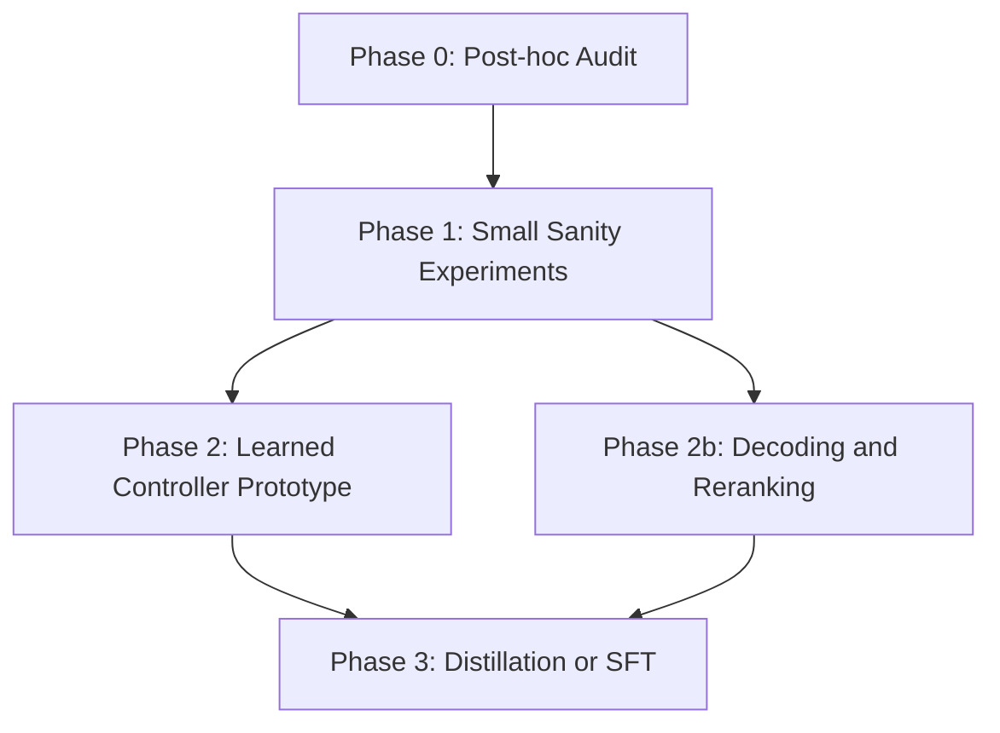

# 新实验路线图

## 总目标

新的实验不再试图证明 `cand_008` 是部署方案，而是回答四个更可检验的问题：

1. 熵相关方向是否是稳定机制信号？
2. 固定 ITI 失败是因为方向不行，还是 gate/alpha 策略不行？
3. 不改 hidden state 的 decoding/reranking 是否更稳？
4. 是否值得进入 learned controller 或 distillation/SFT？

## 实验分层

## Phase 0: Post-hoc Evidence Audit

### 目标

不重新跑大模型，先用已有 artifacts 判断信号质量。

### 已完成基础

- `reports/artifact_audit_summary.md`
- `reports/direction_asset_audit.md`

### 关键发现

- `mlp.output|layer_18/24` 对 high/low semantic entropy 有强 projection separation。
- `cand008` 部署评估 answer change rate 只有 `3.25%`。
- 旧部署评估的 `all_rows[0:200]` 包含 train/val/test，不能当纯 held-out。
- `Intervention_D` 的 final candidate 是 fallback Pareto representative，不是 robust success。

### 下一步

补充 event-level 审计：

- event count vs token entropy delta；
- event count vs answer changed；
- event count vs correctness transition；
- per-site event density；
- step position distribution。

## Phase 1: Small Sanity Experiments

### 目标

用较小但干净的实验，把“固定 ITI 是否真的无效”和“旧评估是否太粗”分开。

### 实验 1A: Pure Held-out Fixed ITI Recheck

**问题**：`cand_008` 和 `ind_0067` 在纯 test split 上是否仍然弱？

设计：

- split: `test` only；
- questions: all test questions, currently 31；
- seeds: at least `[42, 43, 52, 53, 54]`；
- semantic samples: at least `8`；
- candidates:
  - no intervention；
  - cand008 primary；
  - Intervention_D `ind_0067`；
  - zero-event sham hook if needed。

通过标准：

- correctness non-drop rate = `1.0`；
- answer change rate >= `10%`；
- token_mean 或 token_max 的 abs(mean)/std >= `0.2`；
- semantic breadth within band rate >= `0.8`。

失败解释：

- 如果 answer change rate 仍低，说明固定 ITI 太弱；
- 如果 answer change rate 高但 correctness 波动，说明固定 ITI 不安全；
- 如果 token 指标改善但 semantic/correctness 不稳，说明需要 adaptive gate。

### 实验 1B: Gate Ablation

**问题**：失败是否来自 `prev_entropy_quantile` gate 太粗？

候选 gate：

- `always`；
- `prev_entropy_quantile@0.50`；
- `prev_entropy_quantile@0.67`；
- `prev_entropy_quantile@0.80`；
- position-aware gate；
- entropy-trend gate。

通过标准：

- 至少一个 gate 在 pure test 上同时满足 correctness non-drop 和 token hesitation reduction；
- event density 与 token entropy delta 呈现方向一致关系。

### 实验 1C: Alpha/Sign Stress Test

**问题**：`increase_semantic_high` / `reduce_semantic_high` 的 polarity 是否被误读？

设计：

- alpha grid: `[0.001, 0.0025, 0.005, 0.0075, 0.01, 0.015]`；
- sign: both increase/reduce；
- sites: layer 18 only, layer 24 only, both。

通过标准：

- 存在单调或局部平滑趋势；
- 如果完全无趋势，说明固定 direction 不适合作为控制旋钮。

## Phase 2: Learned Controller Prototype

### 目标

不再手写固定 gate 和 alpha，而是学习一个轻量 controller。

### 输入特征

- previous token entropy；
- token entropy trend；
- token position；
- layer 18 projection；
- layer 24 projection；
- hidden norm；
- current generated length；
- question-level baseline uncertainty estimate。

### 输出

第一版只做二分类：

- intervene；
- do not intervene。

第二版再扩展为：

- alpha bucket；
- site subset；
- polarity。

### 训练标签

优先使用 post-hoc oracle label：

- 对每个 token/step 或每个 question，比较多个候选 intervention 的后验效果；
- 标记 correctness 不掉且 token hesitation 降低的 action 为 positive；
- correctness 掉或 semantic breadth 崩的 action 为 negative。

### 成功标准

- controller 在 held-out test 上优于 fixed ITI；
- safety_success_rate >= `0.67`；
- answer change rate >= `10%`；
- correctness non-drop maintained；
- token hesitation improvement 的 abs(mean)/std >= `0.2`。

## Phase 2b: Decoding / Reranking

### 目标

不改 hidden state，只在输出策略层利用 entropy signals。

候选方法：

1. entropy-aware temperature schedule；
2. uncertainty-triggered shorter answer mode；
3. multi-sample semantic reranking；
4. answer confidence reranking；
5. cluster-stable answer selection。

### 为什么值得做

当前固定 ITI 改变回答很少，但 entropy signal 对 difficulty 有区分度。decoding/reranking 更可能在不伤 correctness 的情况下减少犹豫。

### 成功标准

- correctness 不掉；
- semantic breadth 不塌；
- token length 或 hesitation 下降；
- answer selection 更稳定；
- latency 需要在 cache-aware setting 下单独评估。

## Phase 3: Distillation / SFT

### 目标

如果 controller/reranking 有稳定收益，再把行为训练进模型。

### 可行路线

- teacher-generated SFT；
- preference distillation；
- confidence-aware loss；
- uncertainty-weighted curriculum；
- rejected-sample filtering。

### 注意

蒸馏不是让 student 学 teacher 的熵分布，而是学：

- teacher outputs；
- teacher token distributions；
- teacher preference；
- teacher answer style；
- teacher reasoning trajectory。

熵只作为辅助权重或筛选信号。

## 优先级排序

| Priority | Experiment | Why |
| ---: | --- | --- |
| 1 | Pure Held-out Fixed ITI Recheck | 先修正旧部署评估混入 train 的问题 |
| 2 | Gate Ablation | 判断是否只是 gate 太粗 |
| 3 | Alpha/Sign Stress Test | 判断方向是否可作为控制旋钮 |
| 4 | Decoding/Reranking | 低风险替代路线 |
| 5 | Learned Controller | 最有希望但工程量更大 |
| 6 | Distillation/SFT | 只有前面成立才值得进入 |

## 决策规则

- 如果 Phase 1 全部失败：停止固定 ITI 主线。
- 如果 Phase 1 有局部成功但不稳定：进入 learned controller。
- 如果 decoding/reranking 成功：优先走输出策略路线。
- 如果 controller 成功：再考虑训练式 distillation/SFT。
- 如果所有路线都只能影响 entropy 但不影响 answer behavior：论文应写成 mechanistic negative result。
